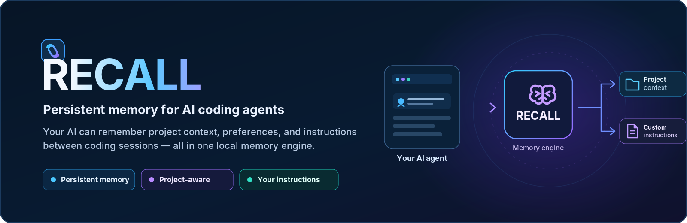
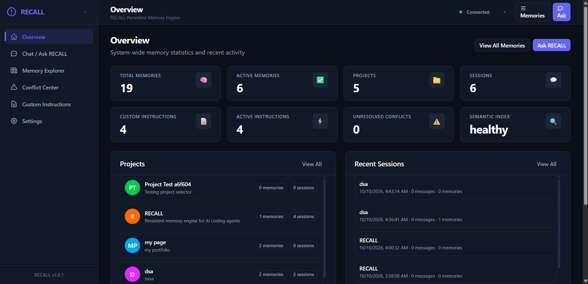
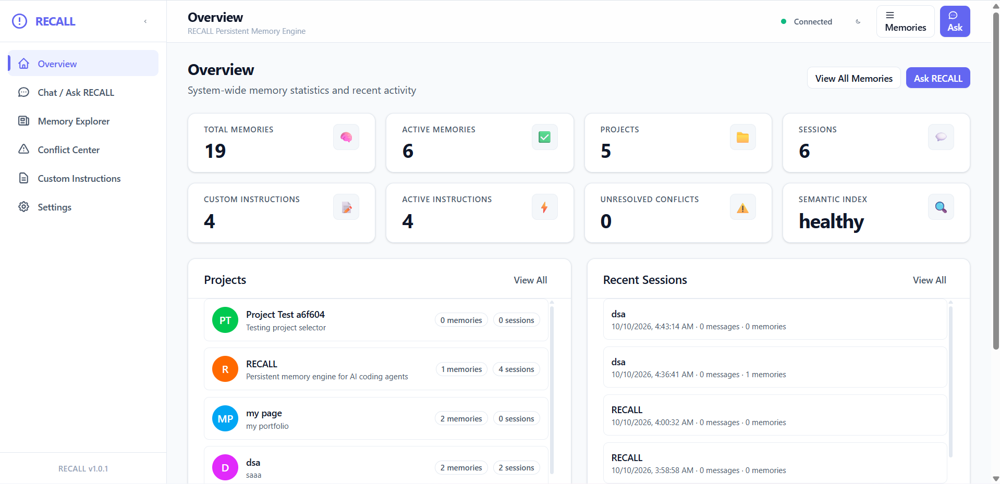

<p align="center">
  
</p>

# RECALL — Persistent Memory Engine for AI Coding Agents

> **Persistent project memory, custom instruction enforcement, and deterministic context retrieval for AI coding agents.**

AI coding assistants lose critical context the moment a session ends. Every new conversation forgets past architectural decisions, project conventions, library choices, and user preferences. Repeatedly explaining the same constraints wastes time and leads to conflicting suggestions.

**RECALL** solves this by providing a local, persistent cognitive memory layer for AI coding agents. It records key project facts, tracks lineage across sessions, respects explicit user instructions above all else, arbitrates conflicting historical context, and exposes unified context via the **Model Context Protocol (MCP)** and a human-facing **Web Dashboard**.

RECALL is the memory engine itself — not a standalone chatbot or a coding agent. It is designed to pair seamlessly with agents such as OpenCode, Google Antigravity, Cursor, and Claude.

---

## 💡 What RECALL Does

- **Preserves Long-Term Project Memory:** Captures architectural decisions, conventions, patterns, and facts in a canonical, structured SQLite ledger that persists across sessions.
- **Enforces User-Authored Custom Instructions:** Gives top-tier authority to explicit developer rules across global or project scopes, preventing agents from drifting from established rules.
- **Retrieves Relevant Context On Demand:** Uses hybrid keyword and semantic retrieval to fetch relevant memories when an agent prepares a prompt.
- **Resolves Context Conflicts Deterministically:** Detects contradictions between historical memories and arbitrates them using strict authority rules and bounded local arbitration, returning an explicit unresolved state rather than hallucinating certainty.
- **Maintains Memory Lineage:** Tracks when newer decisions supersede older ones, ensuring auditability and safe context compaction.

---

## 🔄 How It Works

RECALL coordinates memory capture, storage, and retrieval in a straightforward 5-stage pipeline:

<p align="center">
  
</p>

1. **You work with your AI agent:** Write code and ask questions in your daily tools (OpenCode, Antigravity, Cursor, Claude).
2. **Context is captured:** RECALL captures relevant decisions, instructions, and context through `/recall` commands or MCP tools.
3. **Relevant context is retrieved:** Fast keyword matching and semantic search extract the most relevant project memories.
4. **Conflicts are resolved:** Contradictions are evaluated against authority rules, using a small bounded local LLM when ambiguity remains.
5. **Agent responds with accurate context:** Your agent receives consistent, up-to-date context tailored to your project.

### Architecture Overview

<p align="center">
  
</p>

- **SQLite (Canonical Truth):** Authoritative storage for projects, sessions, memories, lineage, and custom instructions (stored at `~/.recall/recall.sqlite3`).
- **ChromaDB (Derived Index):** Optional semantic vector index that can always be completely rebuilt from SQLite.
- **Local LLM (Bounded Arbitration):** Bounded 1B–3B local model for residual conflict arbitration; cannot override user instructions or mutate storage directly.
- **MCP Server & REST API:** Open standards for agent IDE integration and frontend dashboard access.

### Memory Authority Rules

When memories or instructions conflict, RECALL applies strict hierarchical authority:

```text
Explicit user custom instruction (Global / Project)
        ↓
Explicit user update / supersession
        ↓
Current valid canonical memory
        ↓
Older historical memory
        ↓
Local 1B–3B arbitration for residual ambiguity
        ↓
Unresolved / abstain
```

---

## 🖥️ Web Dashboard Preview

RECALL includes a developer cockpit built with React and Tailwind CSS. The dashboard allows developers to explore memories, manage custom instructions, audit conflict resolutions, inspect system health, and toggle between Light and Dark themes.

<p align="center">
  
</p>

<p align="center">
  
</p>

### Dashboard Capabilities
- **Overview:** System-wide statistics for total memories, active memories, project breakdown, instruction count, and semantic index status.
- **Memory Explorer:** Search, inspect, filter, edit, and soft-delete memories across projects and lifecycle states (active, superseded, archived, deleted).
- **Conflict Center:** Inspect detected conflicts, review winning memories, and trace arbitration rationale.
- **Custom Instructions:** Create, update, toggle, and delete global and project-scoped developer instructions.
- **Chat / Ask RECALL:** Query assembled context directly to verify agent retrieval before starting a coding session.

---

## ⚡ Getting Started

### Prerequisites

- **Python 3.11+**
- **Node.js 18+ & npm**

### 1. Installation

Clone the repository and set up a virtual environment from the `RECALL/` root directory:

```bash
# Clone the repository
git clone https://github.com/dp9318/RECALL.git
cd RECALL

# Create and activate virtual environment
python -m venv .venv

# On Linux / macOS:
source .venv/bin/activate

# On Windows (PowerShell):
.venv\Scripts\Activate.ps1

# Install RECALL core, MCP adapter, and semantic index dependencies:
pip install -e "core[mcp,semantic]"
```

### 2. Start the Backend API

From the repository root (`RECALL/`):

```bash
python -m core.recall_core.api
```

*(Alternatively, run with hot reload):*
```bash
uvicorn core.recall_core.api:app --host 0.0.0.0 --port 8080 --reload
```

- **API Base URL:** `http://localhost:8080`
- **Health Endpoint:** `http://localhost:8080/health`
- **Interactive OpenAPI Docs:** `http://localhost:8080/docs`

### 3. Start the Web Dashboard

From a new terminal in the repository root:

```bash
cd frontend
npm install
npm run dev
```

- **Dashboard URL:** `http://localhost:5173`
- The development server automatically proxies API requests to `http://localhost:8080`.

---

## 🔌 Model Context Protocol (MCP) Setup

RECALL includes a built-in MCP server (`recall_mcp.server`) exposing 9 standardized tools to AI coding agents:

| MCP Tool | Purpose |
| --- | --- |
| `recall_search` | Search memories across projects with keyword or semantic matching |
| `recall_get_context` | Assemble active project memories and matching custom instructions |
| `recall_save_memory` | Save a new memory record into canonical SQLite storage |
| `recall_update_context` | Persist an explicit context update taking high precedence |
| `recall_compact` | Summarize older memories above the active cap while preserving lineage |
| `recall_list_custom_instructions` | List custom instructions filtered by scope, project, or status |
| `recall_create_custom_instruction` | Create user instructions (global or project-scoped) |
| `recall_update_custom_instruction` | Update instruction content or toggle active status |
| `recall_delete_custom_instruction` | Deactivate / soft-delete a custom instruction |

Configure your client of choice by pointing to your local Python interpreter and RECALL repository root:

### Google Antigravity

Add the server to `.agents/mcp_config.json` in your workspace or global customization root:

```json
{
  "mcpServers": {
    "recall": {
      "command": "python",
      "args": ["-m", "recall_mcp.server"],
      "cwd": "/path/to/RECALL"
    }
  }
}
```

> **Note:** If using a virtual environment, replace `"python"` with the absolute path to your virtual environment interpreter (e.g. `"/path/to/RECALL/.venv/bin/python"` or `"C:\\path\\to\\RECALL\\.venv\\Scripts\\python.exe"`).

### Cursor

Add to `~/.cursor/mcp.json` or `.cursor/mcp.json`:

```json
{
  "mcpServers": {
    "recall": {
      "command": "python",
      "args": ["-m", "recall_mcp.server"],
      "cwd": "/path/to/RECALL"
    }
  }
}
```

### OpenCode

Add to your workspace `.opencode/opencode.json`:

```json
{
  "$schema": "https://opencode.ai/config.json",
  "mcp": {
    "recall": {
      "type": "local",
      "command": ["python", "-m", "recall_mcp.server"],
      "cwd": "/path/to/RECALL",
      "enabled": true
    }
  }
}
```

### Claude Desktop

Add to `claude_desktop_config.json`:

```json
{
  "mcpServers": {
    "recall": {
      "command": "python",
      "args": ["-m", "recall_mcp.server"],
      "cwd": "/path/to/RECALL"
    }
  }
}
```

---

## ✨ Features at a Glance

- 🧠 **Dual Storage Strategy:** SQLite for canonical durable ledger; ChromaDB for fast derived embeddings.
- 🎯 **Explicit Instruction Priority:** User-authored instructions always override inferred memories.
- ⚖️ **Conflict Arbitration:** Deterministic lineage rules backed by local small LLM arbitration when ambiguous.
- 🌓 **Instant Theme Switching:** Focused Light and Dark themes with full contrast accessibility.
- 📊 **Accurate System Statistics:** Exact canonical counts for active and total memories, avoiding duplicate project aggregation.
- 🔒 **Local & Private:** Runs entirely on your machine; no external cloud database dependency required.

---

## 🧪 Testing & Verification

Run the test suite from the repository root:

```bash
# Run core unit and integration tests:
python -m pytest core/tests -q

# Run full backend test suite:
pytest -q

# Run frontend test suite & production build:
cd frontend
npm run build
```

---

## 📦 Project Status & Documentation

- **Current Version:** `v1.0.1`
- **License:** MIT

Detailed technical documentation is available in the `docs/` directory:
- [Problem Statement](docs/PROBLEM_STATEMENT.md)
- [Product Requirements Document (PRD)](docs/PRD.md)
- [Architecture Specifications](docs/ARCHITECTURE.md)
- [Design Document](docs/DESIGN.md)
- [Technology Stack](docs/TECH_STACK.md)
- [Development Rules](docs/DEVELOPMENT_RULES.md)
- [Team Workflow & Contributing](docs/TEAM_WORKFLOW.md)
- [MCP Module Documentation](docs/modules/MCP.md)
